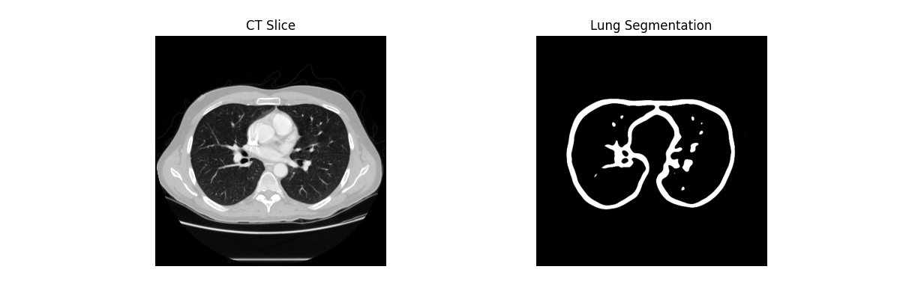
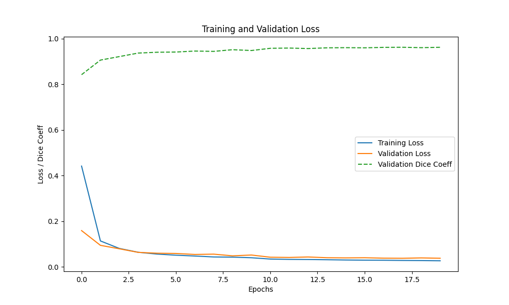

## 💡 Idea

The core idea is to build a segmentation model that takes in raw 2D CT slice image as input and outputs binary masks indentifying the lung regions.

- **Input:** Preprocessed CT slices in '.npy' format.
- **Label:** Manually annotated lung segmentation masks.
- **Model:** U-Net convolutional neural network.
- **Output:** Model-predicted lung sefmentation masks.
- **Goal:** Enable automatic and accurate lung segmentation for further analysis

---

# Data preprocessing with Pylidc libraty

I used the LIDC-IDRI dataset for model training, which you can download from the following link:https://www.cancerimagingarchive.net/collection/lidc-idri/

After I got the original data, I found that many of the directories in this data set were numbered with specific numbers, and I couldn't find any pattern intuitively, for example:

```plaintext
LIDC-IDRI/                          #The folder of LIDC-IDRI you downloaded
|
|___ manifest-1745041377543/
     |___ LIDC-IDRI/
     |    |___ LIDC-IDRI-0001/
     |    |    |___ 01-01-2000-NA-NA-30178/
     |    |    |    |___ 30005666.000000-NA-03192/
     |    |    |    |    |___ 1-001.dcm
     |    |    |    |    |___ 1-xxx.dcm
     |    |    |    |    |___ ...
     |    |    |    |    |___ 1-133.dcm
     |    |    |    | 
     |    |    |    |___ #Other folders containing nodule slices and nodule annotations
     |    |    |
     |    |    |___ 01-01-2000-NA-NA-35511/
     |    |         |___ 3000923.000000-NA-62357/
     |    |              |___ 1-1.dcm
     |    |              |___ 1-2.dcm
     |    |              |___ 068.xml
     |    |___ ... 
     |
     |___ metadata.csv

```
Then this contains hundreds of DCM files, which are the original CT data of the patient. This warehouse is mainly used for lung segmentation, so only this CT data is used, and nodule slices and nodule annotation data are not used. Please do not confuse lung nodule segmentation with lung segmentation.

However, the hard-coded path in each patient folder is different, so we need to do some additional processing and then save the required files to the corresponding location according to a specific naming format for easy subsequent operations.

The following is another big guy's approach that I referred to, but I will provide my own processing flow in this repository, step by step:https://github.com/jaeho3690/LIDC-IDRI-Preprocessing/tree/master

 **pylidc library**
 
 To do this data processing you need to download the pylidc library, and here is its [documentation](https://pylidc.github.io/install.html).
 You need to write a configuration file according to the documentation to let the library know which file path you are processing. It is worth mentioning that when I wrote the path according to the documentation, similar to path = /path/to/big_external_drive/datasets/LIDC-IDRI, an error was reported. I think it was because I was using the Windows system. When I changed '/' to '\\', the configuration file took effect. When you actually use it, if you want to change your dataset path, please make sure to change the path of the configuration file as well, which will be mentioned later.

# Code usage process and instructions
## 1.
```bash
python config_file_create.py
```
This file will generate the configuration file lung.conf', which defines some paths to save the original CT images of patients preprocessed from the original dataset using pylidc, lung segmentation images, CT data is not regularized, and lung data is not binarized.

Please note that there is a configuration variable LIDC_DICOM_PATH. When you change the path of the loaded dataset, you also need to change its value, otherwise the subsequent program will read the wrong value.

## 2.
```bash
python prepare_lung_image.py
```
At this point, we start preparing the data for model training. One is the original CT slice data, and the other is the corresponding lung segmentation slice. At this time, neither of the two data has been regularized or binarized. After that, you will get a folder in which the data set is stored according to the rules. Due to my equipment, I only used 220 patient data sets when I did the project. At the same time, for each patient, I only took the middle ten slices of his total CT data. These slices all contain the entire lung area well, and the model can easily learn the features.

## 3.
```bash
python Lung_segmentation.py
```
When you enter this command, the model starts training. It will regularize the CT data set just prepared, binarize the lung segmentation data set, and then input it into the model for training. (Of course, there will be no error only if you have written the code for saving the prediction image to be output).

Once the model is running, it is estimated that it will take 20 hours to complete the training. Anyway, my 4050 graphics card ran it for 22 hours.If you have the conditions or want a more accurate prediction model, you can add more training parameters appropriately and expand the range of selected slices. In my final prediction, only the slices on both sides will have a slight error, while the CT slices focused on the front of the lungs can almost be predicted well.

After the model is trained, you can see some prediction images and loss curves, similar to:





**Off topic**: During early experiments,the model training was unstable -- loss would either not decrease or turn into NaN.This issue was resolved by applying **gradient clipping** after backpropagation and before optimizer step:
```bash
torch.nn.urils.clip_grad_norm_(model.parameters(), max_norm=1.0)
```
This clips the total norm of all gradient to 1.0, preventing **gradient explosion**,which is a common issue in deep models like U-Net.It ensures the training process remains stable,especially during the early epochs when gradients can fluctuate dramatically.

## 4.
```bash
python prepare_lung_image.py
```
After the model training is completed, it is time to make actual predictions. This script will generate a folder to save a batch of processed patient original CT data sets. Mainly, there is no lung segmentation image set here, because our model will predict lung segmentation output based on the input CT images. **(Important: You must modify the test set path you want to read in pylidc.conf and the LIDC_DICOM_PATH variable in lung.conf, otherwise you will not be able to read the data correctly!).**


## 5.
```bash
python model_test.py
```
Finally, the model is tested and the predicted results are saved in the directory you specified. Each patient has a corresponding folder.

# Other script descriptions

```bash
utils.py
```
This script has a lung segmentation function and a function that checks if a directory exists.

```bash
image_test.py  
```
When processing data, sometimes you have to see what the loaded data looks like, so a tool that can view the data is necessary. This script provides this function

```bash
UNet_nn.py
```
The U-Net network architecture uses padding. It is not a strict reproduction of the 2015 paper without padding, but this is just a simple project.

# Summary and experience
2025, this is my first project on medical image processing. I think it is a cool thing to put your ideas into reality. I hope my work can benefit you. Once again, thank you to all the experts who are willing to open source and share their experiences. I have learned a lot.
